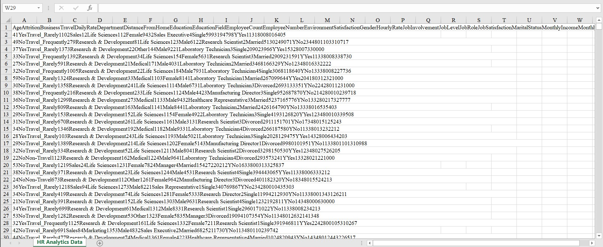
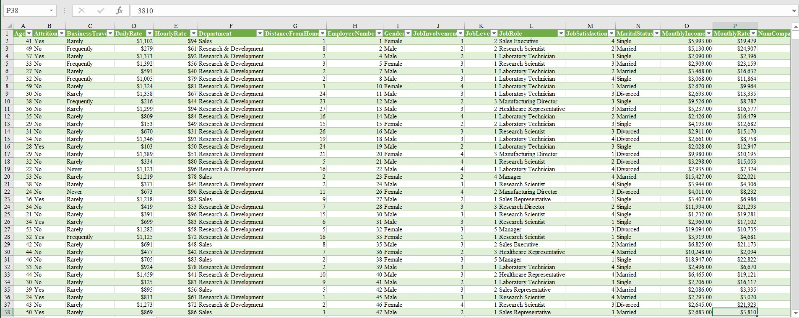
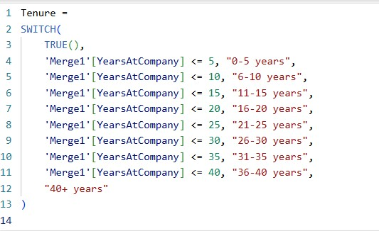
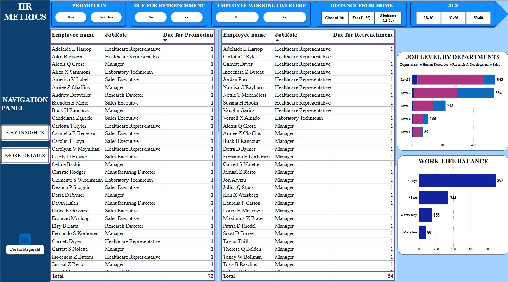

# HR-METRICS ANALYSIS

## Project Overview

This project presents an in-depth analysis of key Human Resource (HR) metrics within an organization. It aims to provide actionable insights into employee dynamics such as satisfaction, promotion eligibility, warnings, tenure, work-life factors etc — all critical for HR decision-making and workforce planning.

The primary goal is to empower HR teams with data-driven insights to:

1. Track employee satisfaction and readiness for promotion.
2. Understand warning patterns and tenure distribution.
3. Identify potential areas for intervention or improvement.
4. Make smarter, faster HR decisions backed by visuals.

## Dataset Information

**Source:** _Collected for educational analysis._

This dataset captures a wide range of HR-related factors used to assess employee experience, satisfaction, and organizational dynamics. It supports exploration into areas such as promotion readiness, job level, income patterns, work-life balance, employee tenure etc.

The dataset consists of **1,471** rows and **20** columns, each representing employee-level data points across multiple experience markers.

**Key Column Overview:**

- **Age** – The age of the employee.
- **Attrition** – Whether the employee has left the company (Yes/No).
- **BusinessTravel** – Frequency of business travel (e.g., Rarely, Frequently, Non-Travel).
- **Department** – The department the employee works in (e.g., Sales, HR, R&D).
- **DistanceFromHome** – Distance (in kilometers/miles) between the employee’s home and workplace.
- **EmployeeNumber** – Unique identifier for each employee.
- **Gender** – Gender of the employee (Male/Female).
- **JobInvolvement** – Degree of involvement or commitment the employee has toward their job (1–4).
- **JobLevel** – Level or rank of the employee within the organization (1-5).
- **JobRole** – Specific job title or role (e.g., Sales Executive, Research Scientist).
- **JobSatisfaction** – Employee’s satisfaction level with their job (1 = Low, 4 = Very High).
- **MaritalStatus** – Marital status of the employee (Single, Married, Divorced).
- **MonthlyIncome** – Monthly income of the employee.
- **OverTime** – Whether the employee works overtime (Yes/No).
- **TotalWorkingYears** – Total number of years the employee has spent in the workforce.
- **TrainingTimesLastYear** – Number of training programs attended in the past year.
- **WorkLifeBalance** – Employee’s perception of work-life balance (1 = Very low, 4 = Very high).
- **YearsAtCompany** – Number of years the employee has worked at the current company.

## Tools Used

- Microsoft Excel – For data cleaning, formatting, and initial exploration.
  - [Need this? Click to download Microsoft Excel.](https://microsoft.com)

- Power Query – For shaping, transforming, and merging data.

- Power BI – For visual modeling, interactive dashboards, and storytelling.
  - [Need this? Click to download Power BI.](https://www.microsoft.com/en-us/power-platform/products/power-bi/downloads)

## Project Objectives
**1. Analyze Employee Attrition Trends**
  - Identify patterns and key indicators contributing to employee turnover, such as job satisfaction, work-life balance, and distance from home.

**2. Assess Employee Performance and Engagement**
  - Evaluate how factors like job involvement, job satisfaction, and training impact performance ratings and engagement levels.

**3. Explore Compensation and Promotion Insights**
  - Investigate relationships between income levels, salary, and years since last promotion to highlight possible inequities or gaps.

**4. Segment the Workforce for Strategic Decision-Making**
  - Group employees by job roles, departments, and satisfaction levels to help HR teams tailor their policies and retention strategies.

**5. Visualize Workforce Demographics and Trends**
  - Use interactive dashboards to represent employee distribution across age, gender, and marital status for diversity and inclusion insights.

**6. Support Data-Driven HR Decisions**
  - Provide management with clear, actionable insights that can guide planning around recruitment, promotions, training, and employee well-being.

## Data Cleaning & Preparation

Before any analysis could begin, the raw dataset required thorough cleaning and transformation to make it usable and reliable. 

Below are the key steps I took:

- Column Separation in Excel
  - The original dataset had all values merged into a single column. Using Text to Columns (Alt + A + E), I separated the data into appropriate individual columns for proper structuring.

RAW                                                                    |  PROCESSED          
:--------------------------------------------------------------------: | :----------------------------------------------------------------------------------:
                                                       |   

- Duplicate Check
  - I scanned the dataset for duplicate records and ensured only unique entries were retained to prevent skewed insights.

- Font & Formatting Standardization
  - I ensured consistency in data presentation by standardizing font types and sizes, which helped with clarity during analysis.

- Power Query Transformations
I imported the dataset into Power Query for more structured cleaning:

  - Renamed Columns: Adjusted column names for clarity and consistency.
    
  - Replaced Values: Used the Replace Values function to improve interpretability. For instance, changing numeric values in worklife balance ratings to descriptive labels like “Low,” “High” etc.
    
  - Filtered Out Irrelevant Data: Removed null values and any columns not relevant to the analysis.
    
  - Changed Data Types: Ensured that numerical fields (e.g., Age, MonthlyIncome) and categorical fields (e.g., Department, Gender) were assigned the correct data types.
    
  - Created Custom Columns:
    To enhance the insights from the dashboard, I wrote custom DAX formulas to create calculated columns that grouped continuous variables into more interpretable categories. These included:
    
      - Age Grouping – Categorized employees into age bands (e.g., 18–30, 31–50, etc.).
        
      - Distance Bands – Grouped employee travel distances into Close 0-10, Moderate 10-20, and Far 21-30 ranges.
        
      - Years at company – Oragnized numeric ratings (1–40) into categories (e.g., 0-5 years, 6-10years etc.)
        
      - Job Level & Work-Life Balance Tiers – Reorganized internal rating scales into understandable segments for quicker comparisons.
      
        A DAX Formula I used Example:

        

These engineered features made the visualizations easier to interpret and more aligned with real-world business categories.

## Data Analysis and Visualizations

**Understand the demographics and age distribution of employees**

- Most employees fall within the 31–50 age group (941), indicating a mature workforce.

- There are fewer employees aged 51–60 (143), suggesting potential upcoming retirements.

- The 18–30 group represents the smallest slice, which may signal a need for graduate recruitment or internship pipelines.

