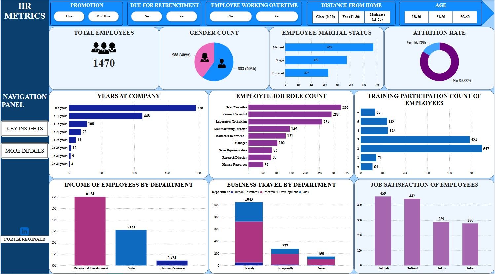
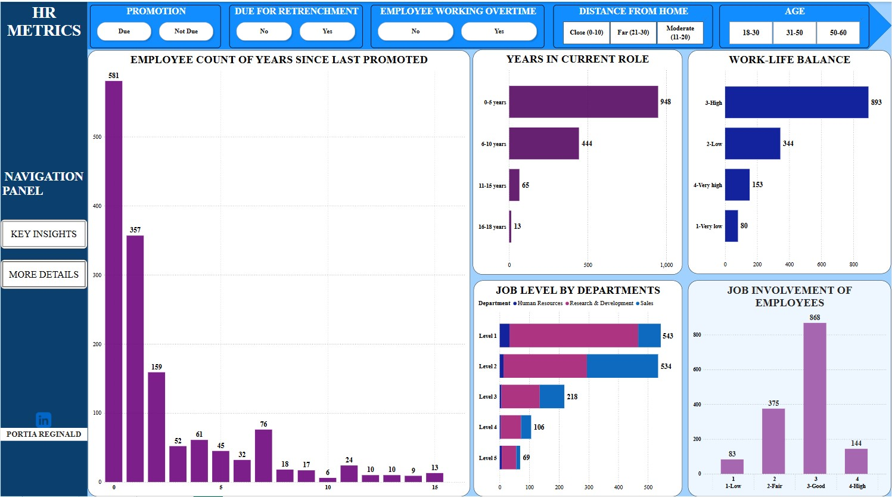
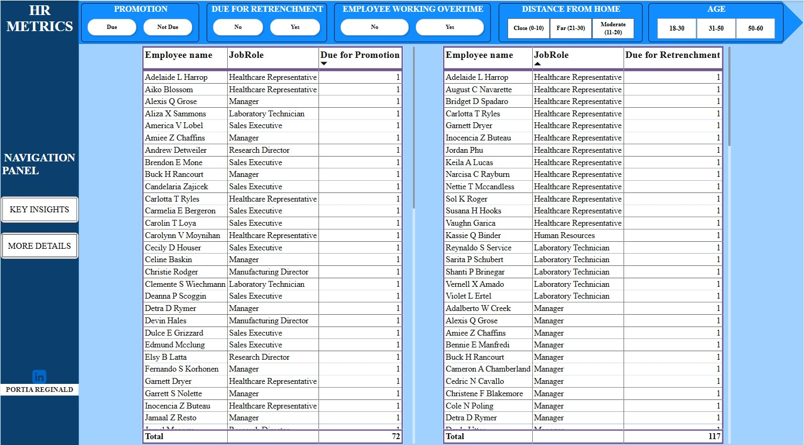

# HR-METRICS ANALYSIS

## Project Overview

This project presents an in-depth analysis of key Human Resource (HR) metrics within an organization. It aims to provide actionable insights into employee dynamics such as satisfaction, promotion eligibility, warnings, tenure, work-life factors etc — all critical for HR decision-making and workforce planning.

The primary goal is to empower HR teams with data-driven insights to:

1. Track employee satisfaction and readiness for promotion.
2. Understand warning patterns and tenure distribution.
3. Identify potential areas for intervention or improvement.
4. Make smarter, faster HR decisions backed by visuals.

## Dataset Information

**Source:** _Collected for educational analysis._

This dataset captures a wide range of HR-related factors used to assess employee experience, satisfaction, and organizational dynamics. It supports exploration into areas such as promotion readiness, job level, income patterns, work-life balance, employee tenure etc.

The dataset consists of **1,471** rows and **20** columns, each representing employee-level data points across multiple experience markers.

**Key Column Overview:**

COLUMNS                                         |DESCRIPTION
:-----------------------------------------------|:------------------------------------------------------
Age                                             |The age of the employee
BusinessTravel                                  |Frequency of business travel (e.g., Rarely, Frequently, Non-Travel)
DistanceFromHome                                |Distance (in kilometers/miles) between the employee’s home and workplace
JobInvolvement                                  |Degree of involvement or commitment the employee has toward their job (1–4)
JobLevel                                        |Level or rank of the employee within the organization (1-5)
OverTime                                        |Whether the employee works overtime (Yes/No)
WorkLifeBalance                                 |Employee’s perception of work-life balance (1 = Very low, 4 = Very high)

## Tools Used

- Microsoft Excel – For data cleaning, formatting, and initial exploration.
  - [Need this? Click to download Microsoft Excel.](https://microsoft.com)

- Power Query – For shaping, transforming, and merging data.

- Power BI – For visual modeling, interactive dashboards, and storytelling.
  - [Need this? Click to download Power BI.](https://www.microsoft.com/en-us/power-platform/products/power-bi/downloads)

## Project Objectives

**Understand the Demographic Distribution of Employees.**
  - To analyze employee age, gender, marital status, department, and job level in order to understand the workforce structure and diversity.

**Assess Job Satisfaction and Related Experience Metrics.**
  - To examine employee satisfaction ratings (job satisfaction, relationship satisfaction, involvement, work-life balance) and how they vary across departments and roles.

**Identify Employees Due for Promotion.**
  - To detect staff who have stayed long in their current roles or haven’t been promoted recently and may be ready for advancement.

**Flag Potential Retrenchment Risks.**
  - To identify patterns such as low job satisfaction, long commute, or overtime work that may indicate burnout or disengagement.

**Track Overtime and Work-Life Balance.**
  - To explore the distribution of overtime work and its correlation with work-life balance and job satisfaction.

**Enable Dynamic Filtering Through Interactive Slicers.**
  - To provide HR decision-makers with filters (age group, distance, overtime, promotion readiness, retrenchment risk) to allow for customized exploration of employee insights.

**Support Data-Driven HR Decisions Through Clear Visualizations.**
  - To build a visually intuitive and interactive dashboard that makes it easy to spot trends, compare groups, and make strategic HR decisions.

## Data Cleaning & Preparation

Before any analysis could begin, the raw dataset required thorough cleaning and transformation to make it usable and reliable. 

Below are the key steps I took:

- **Column Separation in Excel**
  - The original dataset had all values merged into a single column. Using Text to Columns (Alt + A + E), I separated the data into appropriate individual columns for proper structuring.

RAW                                                                    |  PROCESSED          
:--------------------------------------------------------------------: | :----------------------------------------------------------------------------------:
                                                       |   

- **Duplicate Check**
  - I scanned the dataset for duplicate records and ensured only unique entries were retained to prevent skewed insights.

- **Font & Formatting Standardization**
  - I ensured consistency in data presentation by standardizing font types and sizes, which helped with clarity during analysis.

- **Power Query Transformations**

    I imported the dataset into Power Query for more structured cleaning:

  - **Renamed Columns**: Adjusted column names for clarity and consistency.
    
  - **Replaced Values:** Used the Replace Values function to improve interpretability. For instance, changing numeric values in worklife balance ratings to descriptive labels like “Low,” “High” etc.
    
  - **Filtered Out Irrelevant Data:** Removed null values and any columns not relevant to the analysis.
    
  - **Changed Data Types:** Ensured that numerical fields (e.g., Age, MonthlyIncome) and categorical fields (e.g., Department, Gender) were assigned the correct data types.
    
  - **Created Custom Columns:** To enhance the insights from the dashboard, I wrote custom DAX formulas to create calculated columns that grouped continuous variables into more interpretable categories.
      These included:
    
      - Age Grouping – Categorized employees into age bands (e.g., 18–30, 31–50, etc.).
        
      - Distance Bands – Grouped employee travel distances into Close 0-10, Moderate 10-20, and Far 21-30 ranges.
        
      - Years at company – Oragnized numeric ratings (1–40) into categories (e.g., 0-5 years, 6-10years etc.)
        
      - Job Level & Work-Life Balance Tiers – Reorganized internal rating scales into understandable segments for quicker comparisons.
  
  Sample of DAX Formula:

  

These engineered features made the visualizations easier to interpret and more aligned with real-world business categories.

## 📊DATA ANALYSIS & VISUALIZATION

This analysis was conducted using a structured HR dataset consisting of 1,470 employee records and 20 columns, focusing on core workforce metrics such as job satisfaction, distance from home, job level, overtime, and readiness for promotion or retrenchment. The dataset was modeled and visualized in Power BI using DAX-based custom groupings and slicers to improve interactivity and decision-making clarity.

Explore the insights from my dashboard below:

[HR_METRICS_PROJECT.pbix](https://github.com/Portia-Reginald/HR-METRICS/blob/main/HR_METRICS_PROJECT.pbix)

## **👥 Workforce Demographics**

**Total Employees:**

1,470 employees were analyzed in this dataset.

**Gender Distribution:**

Male: 882 employees (60%)

Female: 588 employees (40%)

**Marital Status:**

Married: 673 employees (46%)

Single: 470 employees (32%)

Divorced: 327 employees (22%)

**🔎 Insights:**

The workforce is predominantly male (60%), which might reflect industry-specific trends. Efforts toward gender diversity could be considered.

A high proportion of married employees (46%) suggests workforce stability and maturity, potentially impacting benefits structure, engagement programs, and scheduling flexibility.

The divorced population (22%) is significant — worth exploring in relation to job satisfaction, work-life balance, and support policies.

## **🧓 Age Distribution**

Grouped as:

18–30 years: 386 employees (26%)

31–50 years: 941 employees (64%)

51–60 years: 143 employees (10%)

🔎 Insights:

The dominant age group (31–50) reflects a mid-career, experienced workforce.

Only 26% are early-career professionals — a low proportion that may indicate weak entry-level hiring or retention.

The 10% in the 51–60 age range could be nearing retirement; succession planning may be needed.

## **🚗 Distance from Home**

Grouped as:

0–10 km: 1,026 employees (70%)

11–20 km: 240 employees (16%)

21–30 km: 204 employees (14%)

**🔎 Insights:**

Most employees live close to the workplace (within 10 km), which is ideal for lower commute stress and higher punctuality.

Those living 21–30 km away (14%) may face longer commutes, possibly affecting job satisfaction or retention — worth monitoring.

## **🕒 Overtime Distribution**

Working Overtime: 117 employees (8%)

Not Working Overtime: 1,353 employees (92%)

**🔎 Insights:**

Overtime is concentrated among a small segment (8%), which could indicate overdependence on a subset of employees.

This group should be further analyzed to ensure workload balance and avoid burnout.

## **💼 Job Satisfaction Levels**

Grouped into: 

Low, Fair, Good, High

High Satisfaction: 459 employees (31%)

Good Satisfaction: 442 employees (30%)

Combined, 61% of employees report positive satisfaction.

For Sales Executives alone: 112 employees report High satisfaction.

**🔎 Insights:**

A 61% satisfaction rate is encouraging and suggests the current HR policies are effective.

Sales Executives, despite being the largest job group, maintain high satisfaction — a strong sign that frontline roles are well-managed.

Remaining employees with Fair or Low ratings can be targeted for feedback or support.

## **📈 Job Levels & Career Movement**

Employees are categorized across five job levels. Here’s the breakdown as seen on the dashboard:

Job Level 1: 876 employees (60%)

Job Level 2: 359 employees (24%)

Job Level 3: 146 employees (10%)

Job Level 4: 59 employees (4%)

Job Level 5: 30 employees (2%)

**🔎 Insights:**

The majority of employees (60%) are at Job Level 1, which likely includes entry-level or junior roles.

  → This could indicate a large operational workforce or that the organization relies heavily on frontline staff.

Job Levels 2 and 3 make up 34% combined, representing mid-level professionals or supervisors.

  → The proportion is healthy but could suggest a narrow middle layer — potentially limiting promotion routes.

Senior roles (Levels 4 & 5) make up just 6% of the entire workforce.

  → This aligns with a typical pyramid structure but also shows that only a few roles exist for career advancement, which may affect motivation for those at lower levels.

Given the small number of people due for promotion (72 employees), it’s possible that promotions are limited by available higher-level roles, not necessarily performance.

## **📈 Career Movement**

**Due for Promotion**

Total Employees Due for Promotion: 72

Percentage of Workforce: ~4.9% of 1,470 employees

**🔍 Insights:**

Only about 5% of employees are tagged as ready for promotion, which is relatively low.

This may suggest strict promotion criteria, limited upward mobility, or an early-stage workforce where many haven't yet met tenure or performance thresholds.

In combination with the job level data, this small percentage supports the idea of a narrow internal promotion structure.

It may also reflect a need for stronger internal development programs or clearer promotion pipelines.

**Due for Retrenchment**

Total Employees Flagged for Retrenchment: 117

Percentage of Workforce: ~8%

**🔍 Insights:**

A retrenchment-risk figure of 8% could indicate workforce restructuring, performance concerns, or overstaffing in certain departments.

If this overlaps significantly with entry-level staff, it might suggest that some operational roles are at risk due to automation, performance issues, or business realignment.

It would be worth cross-checking job roles, satisfaction ratings, or tenure among those marked for retrenchment to better understand the underlying causes.

## **⏳ Tenure and Career Longevity**

**Years in Current Role**

This metric reflects how long employees have remained in the same position without a role change.

A large portion of employees have spent 2–4 years in the same role.

A smaller portion have stayed 5+ years, with a few outliers beyond 7 years.

**🔍 Insights:**

Moderate tenure in current roles (2–4 years) suggests some stability, but possibly stagnation if not paired with promotions or lateral moves.

High tenure in the same role may indicate a lack of mobility, either due to limited opportunities or poor succession planning.

Conversely, longer tenure in role might also reflect loyalty and mastery in specialized roles.

**Years Since Last Promotion**

This metric sheds light on how long it’s been since employees were last promoted.

Many employees haven’t been promoted in 3+ years.

Only a small percentage were promoted within the last 1–2 years.

**🔍 Insights:**

The long gap since last promotion for most employees aligns with the earlier observation that promotion rates are low.

It may suggest a bottleneck at middle levels, or that promotion policies are time-based rather than performance-based.

This could impact motivation, especially among high performers waiting years for career progression.

## **Conclusion**

This HR Metrics Analysis has provided a comprehensive overview of the workforce across multiple dimensions, including age distribution, job satisfaction, tenure, work-life balance, and promotion/retrenchment readiness.

The findings show that while a large proportion of employees report high job satisfaction and good involvement in their roles, there are significant insights around workforce segmentation that can help drive smarter HR decisions. Notably, the 31–50 age group forms the majority of the workforce (over 63%), and a combined 15% of employees are either due for promotion or potentially at risk of retrenchment—highlighting the need for both talent retention and succession planning strategies.

In addition, overtime appears to be limited to a smaller group (only 8% of the workforce), but this segment may warrant closer attention in terms of workload and burnout risk. Distance from home also presents operational considerations, especially for employees commuting over 20km.

## **Recommendations**

1. Promotion Readiness Review

  - With 72 employees marked as due for promotion, HR can initiate a performance audit to ensure deserving candidates are recognized, while also reducing the risk of stagnation or disengagement.

2. Retrenchment Risk Management

  - The 117 employees flagged as retrenchment-ready should be assessed more closely. Some may benefit from targeted upskilling or reassignment before more drastic decisions are made.

3. Engagement & Retention of Mid-Career Talent

  - Since the 31–50 age group dominates the workforce, tailored retention strategies like leadership tracks, flexible work options, or mentoring programs should be explored to keep this segment engaged and productive.

4. Improve Work-Life Balance Across the Board

  - While many employees report good or high balance, continued focus on reducing unnecessary overtime and offering hybrid/flexible work policies could improve morale and reduce long-term burnout risks.

5. Proximity-Based HR Policies

  - Employees commuting over 20km (444 in total) may benefit from transportation stipends, remote days, or satellite office options, improving productivity and reducing lateness or fatigue.

6. Leverage Satisfaction Data to Improve Retention

  - Satisfaction is highest in Sales Executives and several other roles — explore what’s working in those departments (e.g., leadership, incentives, team culture).Replicate these models across other departments with lower satisfaction ratings to build a stronger, more consistent employee experience.

## CONTACT ME

E-mail: portiareginald06@gmail.com

LinkedIn: [Portia Reginald Anrulika](https://www.linkedin.com/in/portia-reginald-13103719a?utm_source=share&utm_campaign=share_via&utm_content=profile&utm_medium=android_app)
