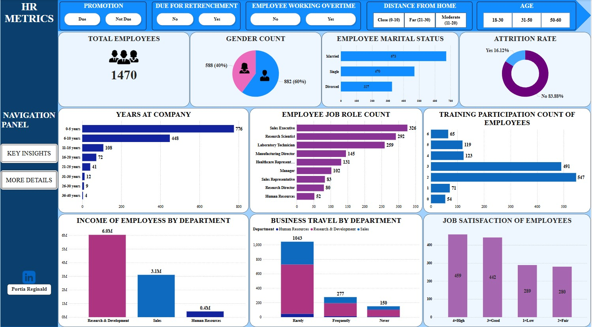

# HR-METRICS ANALYSIS

## Project Overview

This project presents an in-depth analysis of key Human Resource (HR) metrics within an organization. It aims to provide actionable insights into employee dynamics such as satisfaction, promotion eligibility, warnings, tenure, work-life factors etc — all critical for HR decision-making and workforce planning.

The primary goal is to empower HR teams with data-driven insights to:

1. Track employee satisfaction and readiness for promotion.
2. Understand warning patterns and tenure distribution.
3. Identify potential areas for intervention or improvement.
4. Make smarter, faster HR decisions backed by visuals.

## Dataset Information

**Source:** _Collected for educational analysis._

This dataset captures a wide range of HR-related factors used to assess employee experience, satisfaction, and organizational dynamics. It supports exploration into areas such as promotion readiness, job level, income patterns, work-life balance, employee tenure etc.

The dataset consists of **1,471** rows and **20** columns, each representing employee-level data points across multiple experience markers.

**Key Column Overview:**

- **Age** – The age of the employee.
- **Attrition** – Whether the employee has left the company (Yes/No).
- **BusinessTravel** – Frequency of business travel (e.g., Rarely, Frequently, Non-Travel).
- **Department** – The department the employee works in (e.g., Sales, HR, R&D).
- **DistanceFromHome** – Distance (in kilometers/miles) between the employee’s home and workplace.
- **EmployeeNumber** – Unique identifier for each employee.
- **Gender** – Gender of the employee (Male/Female).
- **JobInvolvement** – Degree of involvement or commitment the employee has toward their job (1–4).
- **JobLevel** – Level or rank of the employee within the organization (1-5).
- **JobRole** – Specific job title or role (e.g., Sales Executive, Research Scientist).
- **JobSatisfaction** – Employee’s satisfaction level with their job (1 = Low, 4 = Very High).
- **MaritalStatus** – Marital status of the employee (Single, Married, Divorced).
- **MonthlyIncome** – Monthly income of the employee.
- **OverTime** – Whether the employee works overtime (Yes/No).
- **TotalWorkingYears** – Total number of years the employee has spent in the workforce.
- **TrainingTimesLastYear** – Number of training programs attended in the past year.
- **WorkLifeBalance** – Employee’s perception of work-life balance (1 = Very low, 4 = Very high).
- **YearsAtCompany** – Number of years the employee has worked at the current company.

## Tools Used

- Microsoft Excel – For data cleaning, formatting, and initial exploration.
  - [Need this? Click to download Microsoft Excel.](https://microsoft.com)

- Power Query – For shaping, transforming, and merging data.

- Power BI – For visual modeling, interactive dashboards, and storytelling.
  - [Need this? Click to download Power BI.](https://www.microsoft.com/en-us/power-platform/products/power-bi/downloads)

## Project Objectives

Understand the Demographic Distribution of Employees
➤ To analyze employee age, gender, marital status, department, and job level in order to understand the workforce structure and diversity.

Assess Job Satisfaction and Related Experience Metrics
➤ To examine employee satisfaction ratings (job satisfaction, relationship satisfaction, involvement, work-life balance) and how they vary across departments and roles.

Identify Employees Due for Promotion
➤ To detect staff who have stayed long in their current roles or haven’t been promoted recently and may be ready for advancement.

Flag Potential Retrenchment Risks
➤ To identify patterns such as low job satisfaction, long commute, or overtime work that may indicate burnout or disengagement.

Track Overtime and Work-Life Balance
➤ To explore the distribution of overtime work and its correlation with work-life balance and job satisfaction.

Enable Dynamic Filtering Through Interactive Slicers
➤ To provide HR decision-makers with filters (age group, distance, overtime, promotion readiness, retrenchment risk) to allow for customized exploration of employee insights.

Support Data-Driven HR Decisions Through Clear Visualizations
➤ To build a visually intuitive and interactive dashboard that makes it easy to spot trends, compare groups, and make strategic HR decisions.

## Data Cleaning & Preparation

Before any analysis could begin, the raw dataset required thorough cleaning and transformation to make it usable and reliable. 

Below are the key steps I took:

- Column Separation in Excel
  - The original dataset had all values merged into a single column. Using Text to Columns (Alt + A + E), I separated the data into appropriate individual columns for proper structuring.

RAW                                                                    |  PROCESSED          
:--------------------------------------------------------------------: | :----------------------------------------------------------------------------------:
                                                       |   

- Duplicate Check
  - I scanned the dataset for duplicate records and ensured only unique entries were retained to prevent skewed insights.

- Font & Formatting Standardization
  - I ensured consistency in data presentation by standardizing font types and sizes, which helped with clarity during analysis.

- Power Query Transformations
I imported the dataset into Power Query for more structured cleaning:

  - Renamed Columns: Adjusted column names for clarity and consistency.
    
  - Replaced Values: Used the Replace Values function to improve interpretability. For instance, changing numeric values in worklife balance ratings to descriptive labels like “Low,” “High” etc.
    
  - Filtered Out Irrelevant Data: Removed null values and any columns not relevant to the analysis.
    
  - Changed Data Types: Ensured that numerical fields (e.g., Age, MonthlyIncome) and categorical fields (e.g., Department, Gender) were assigned the correct data types.
    
  - Created Custom Columns:
    To enhance the insights from the dashboard, I wrote custom DAX formulas to create calculated columns that grouped continuous variables into more interpretable categories. These included:
    
      - Age Grouping – Categorized employees into age bands (e.g., 18–30, 31–50, etc.).
        
      - Distance Bands – Grouped employee travel distances into Close 0-10, Moderate 10-20, and Far 21-30 ranges.
        
      - Years at company – Oragnized numeric ratings (1–40) into categories (e.g., 0-5 years, 6-10years etc.)
        
      - Job Level & Work-Life Balance Tiers – Reorganized internal rating scales into understandable segments for quicker comparisons.
      
        A DAX Formula I used Example:

        

These engineered features made the visualizations easier to interpret and more aligned with real-world business categories.

## Data Analysis and Visualizations

## 📊DATA ANALYSIS & VISUALIZATION

This analysis explores key workforce metrics such as age distribution, job satisfaction, job level, distance from home, overtime workload, and employee readiness for promotion or retrenchment. Using Power BI, I built interactive dashboards with slicers and logic-based categories to allow stakeholders to explore the workforce from multiple dimensions.

Explore the insights from my dashboard below:

[HR_METRICS_PROJECT.pbix](https://github.com/Portia-Reginald/HR-METRICS/blob/main/HR_METRICS_PROJECT.pbix)

👥 Workforce Demographics
Total Employees:
1,470 employees were analyzed in this dataset.

Gender Distribution:
Male: 882 employees (60%)

Female: 588 employees (40%)

Marital Status:
Married: 673 employees (46%)

Single: 470 employees (32%)

Divorced: 327 employees (22%)

🔎 Insights:

The workforce is predominantly male (60%), which might reflect industry-specific trends. Efforts toward gender diversity could be considered.

A high proportion of married employees (46%) suggests workforce stability and maturity, potentially impacting benefits structure, engagement programs, and scheduling flexibility.

The divorced population (22%) is significant — worth exploring in relation to job satisfaction, work-life balance, and support policies.

🧓 Age Distribution
Grouped as:

18–30 years: 386 employees (26%)

31–50 years: 941 employees (64%)

51–60 years: 143 employees (10%)

🔎 Insights:

The dominant age group (31–50) reflects a mid-career, experienced workforce.

Only 26% are early-career professionals — a low proportion that may indicate weak entry-level hiring or retention.

The 10% in the 51–60 age range could be nearing retirement; succession planning may be needed.

🚗 Distance from Home
Grouped as:

0–10 km: 1,026 employees (70%)

11–20 km: 240 employees (16%)

21–30 km: 204 employees (14%)

🔎 Insights:

Most employees live close to the workplace (within 10 km), which is ideal for lower commute stress and higher punctuality.

Those living 21–30 km away (14%) may face longer commutes, possibly affecting job satisfaction or retention — worth monitoring.

🕒 Overtime Distribution
Working Overtime: 117 employees (8%)

Not Working Overtime: 1,353 employees (92%)

🔎 Insights:

Overtime is concentrated among a small segment (8%), which could indicate overdependence on a subset of employees.

This group should be further analyzed to ensure workload balance and avoid burnout.

💼 Job Satisfaction Levels
Grouped into: Low, Fair, Good, High

High Satisfaction: 459 employees (31%)

Good Satisfaction: 442 employees (30%)

Combined, 61% of employees report positive satisfaction.

For Sales Executives alone:

112 employees report High satisfaction.

🔎 Insights:

A 61% satisfaction rate is encouraging and suggests the current HR policies are effective.

Sales Executives, despite being the largest job group, maintain high satisfaction — a strong sign that frontline roles are well-managed.

Remaining employees with Fair or Low ratings can be targeted for feedback or support.

📈 Job Levels & Career Movement
Employees are grouped into Job Levels 1 to 5, and two DAX-based indicators were created:

Due for Promotion: 72 employees (5%)

Due for Retrenchment: 117 employees (8%)

🔎 Insights:

With only 5% eligible for promotion, this could reflect limited upward mobility or stringent promotion criteria — which may impact morale and retention.

The 8% retrenchment risk group might require intervention or reassessment — especially if they hold critical roles or departments.

📊 Tenure, Promotion Gaps, and Role Duration
Many employees have been in their current roles for over 5 years, and years since last promotion is also high for a significant portion.

A good number have 10+ years total working experience.

🔎 Insights:

While tenure reflects stability, the long duration without promotion could signal career stagnation.

HR should identify high performers in this category for possible internal mobility or reskilling initiatives.

🎯 Conclusion
This project reveals key strengths and opportunities in workforce dynamics:

✅ Strengths:

High proximity to work and low commute stress

Strong job satisfaction among majority

Stable workforce with mid-care
